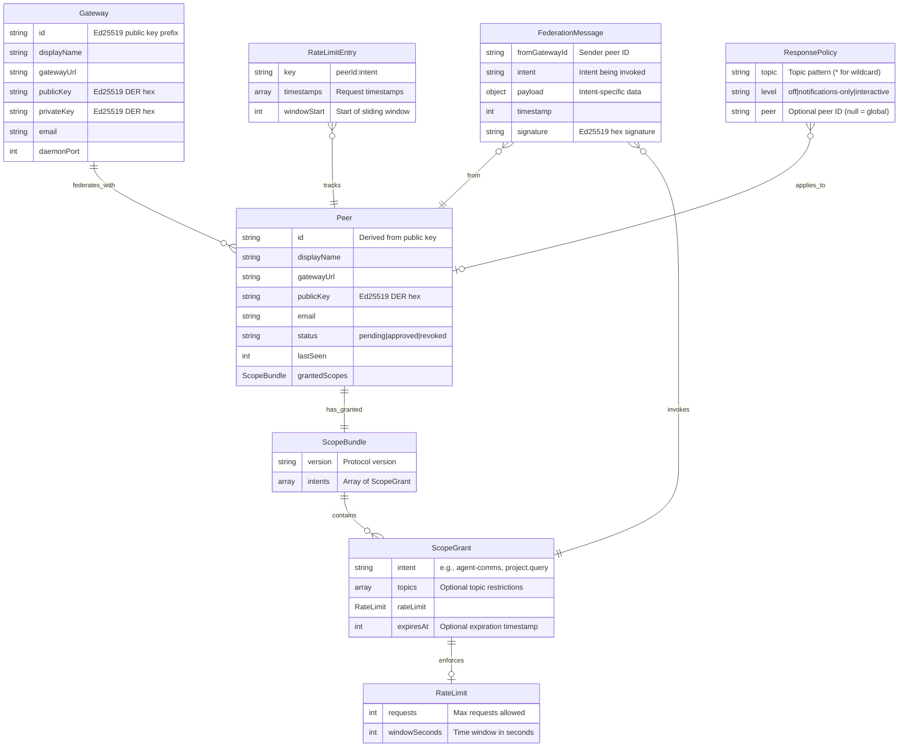

# Data Structures

This section documents the core data structures in OGP that enable gateway-mediated federation with scope isolation.

---

## Entity Relationship Diagram



---

## Structure Definitions

### 1. Peer

**Purpose**: Represents a federated gateway with bilateral trust relationship.

**Storage**: `~/.ogp/peers.json` (file-based, atomic writes)

**Schema**:
```typescript
interface Peer {
  id: string;                    // Peer ID (first 16 hex chars of public key)
  displayName: string;           // Human-readable name (e.g., "Bob (Spain)")
  gatewayUrl: string;            // Current gateway URL (updates on tunnel rotation)
  publicKey: string;             // Ed25519 public key (DER format, hex-encoded)
  email: string;                 // Contact email
  status: "pending" | "approved" | "revoked";
  lastSeen: number;              // Unix timestamp of last message
  grantedScopes: ScopeBundle | null;  // What this peer can invoke on our gateway
  requestedAt: number;           // Unix timestamp of federation request
  approvedAt?: number;           // Unix timestamp of approval
}
```

**Key Operations**:
- `getPeer(id)`: O(1) hash map lookup by peer ID
- `getPeerByPublicKey(publicKey)`: O(n) linear scan (fallback for full public key)
- `updatePeerUrl(id, newUrl)`: Atomic file write with URL update
- `revokePeer(id)`: Set status to "revoked", preserve record for audit trail

**Invariants**:
- `id` must equal first 16 hex chars of `publicKey`
- `status` transitions: `pending` → `approved` → `revoked` (no reverse transitions)
- `grantedScopes` is null for v0.1 backward compatibility (fallback to DEFAULT_V1_SCOPES)

---

### 2. ScopeBundle

**Purpose**: Collection of scope grants defining what a peer can invoke.

**Schema**:
```typescript
interface ScopeBundle {
  version: string;               // Protocol version (e.g., "0.2.0")
  intents: ScopeGrant[];         // Array of granted intents
}
```

**Example**:
```json
{
  "version": "0.2.0",
  "intents": [
    {
      "intent": "agent-comms",
      "topics": ["project-validation", "memory-management"],
      "rateLimit": {"requests": 100, "windowSeconds": 3600}
    },
    {
      "intent": "message",
      "rateLimit": {"requests": 50, "windowSeconds": 3600}
    },
    {
      "intent": "project.query",
      "rateLimit": {"requests": 20, "windowSeconds": 3600}
    }
  ]
}
```

**Key Operations**:
- `createScopeBundle(grants)`: Create new bundle
- `findScopeGrant(bundle, intent)`: O(k) lookup where k = number of intents
- `mergeScopeBundles(b1, b2)`: Union of intents (used in multi-party scenarios)

**Invariants**:
- Intent names must be unique within bundle (no duplicate `intent` values)
- `version` must match protocol version in message headers

---

### 3. ScopeGrant

**Purpose**: Permission to invoke a specific intent with optional restrictions.

**Schema**:
```typescript
interface ScopeGrant {
  intent: string;                // Intent name (exact match required)
  topics?: string[];             // Topic restrictions (null = all topics allowed)
  rateLimit: RateLimit;          // Rate limit for this intent
  expiresAt?: number;            // Optional expiration (Unix timestamp)
}
```

**Topic Matching Rules**:
- If `topics` is `null` or empty array: all topics allowed
- If `topics` is `["*"]`: wildcard, all topics allowed
- Otherwise: exact match OR prefix match
  - Topic `"project-validation/legal"` matches allowed `"project-validation"` ✓
  - Topic `"project-validation/legal"` matches allowed `"project-validation/legal"` ✓
  - Topic `"crypto-trading"` does NOT match allowed `"project-validation"` ✗

**Key Operations**:
- `scopeCoversIntent(grant, intent, topic)`: Check if grant allows intent+topic
- `isExpired(grant)`: Check if current time > `expiresAt`

**Invariants**:
- Intent names use exact matching (NO wildcards like `"project.*"`)
- Topic names use prefix matching (only for agent-comms intent)
- Rate limit must be present (no null rate limits)

---

### 4. RateLimit

**Purpose**: Define request quota for a scope grant.

**Schema**:
```typescript
interface RateLimit {
  requests: number;              // Max requests allowed in window
  windowSeconds: number;         // Time window in seconds
}
```

**Common Configurations**:
```typescript
DEFAULT_RATE_LIMIT = {requests: 100, windowSeconds: 3600}   // 100 req/hour
MONITORING_LIMIT = {requests: 10, windowSeconds: 3600}      // 10 req/hour
HIGH_TRUST_LIMIT = {requests: 1000, windowSeconds: 3600}    // 1000 req/hour
BURST_LIMIT = {requests: 10, windowSeconds: 60}             // 10 req/minute
```

**Key Operations**:
- `checkRateLimit(peerId, intent, limit)`: Sliding window check
- `formatRateLimit(limit)`: Display as "requests/window" (e.g., "100/3600")

**Invariants**:
- `requests` must be positive integer
- `windowSeconds` must be positive integer
- Common window sizes: 60 (minute), 3600 (hour), 86400 (day)

---

### 5. FederationMessage

**Purpose**: Wire format for all federation messages (requests, approvals, intent invocations).

**Schema**:
```typescript
interface FederationMessage {
  fromGatewayId: string;         // Sender peer ID (or full public key)
  intent: string;                // Intent being invoked
  payload: object;               // Intent-specific payload
  timestamp: number;             // Unix timestamp (milliseconds)
  signature: string;             // Ed25519 signature (hex-encoded)
}
```

**Message Types by Intent**:

**agent-comms payload**:
```typescript
{
  topic: string;                 // Topic (e.g., "project-validation")
  content: string;               // Message content for agent
  priority: "urgent" | "normal" | "low";
  conversationId?: string;       // Thread ID for multi-turn conversations
  replyTo?: string;              // Callback URL for async replies
}
```

**project.query payload**:
```typescript
{
  projectId: string;             // Project identifier
  action: "list-contributions" | "get-status" | "list-members";
  filters?: object;              // Optional query filters
  replyTo?: string;              // Callback URL for results
}
```

**message payload**:
```typescript
{
  content: string;               // Notification message
  level: "info" | "warning" | "error";
}
```

**Key Operations**:
- `signMessage(message, privateKey)`: Generate Ed25519 signature over canonical JSON
- `verifyMessage(message, signature, publicKey)`: Verify signature
- `toCanonicalJSON(message)`: Deterministic serialization for signing

**Invariants**:
- Signature is over canonical JSON serialization (excluding `signature` field itself)
- `timestamp` must be within ±5 minutes of receiver's clock (replay protection)
- `intent` must match a recognized intent type

---

### 6. RateLimitEntry

**Purpose**: In-memory tracking of request timestamps for sliding window rate limiting.

**Storage**: In-memory `Map<string, RateLimitEntry>` (ephemeral, not persisted)

**Schema**:
```typescript
interface RateLimitEntry {
  timestamps: number[];          // Array of request timestamps (Unix ms)
  windowStart: number;           // Start of current sliding window
}
```

**Key**: `"${peerId}:${intent}"` (e.g., `"a1b2c3d4e5f6g7h8:agent-comms"`)

**Example**:
```json
{
  "a1b2c3d4e5f6g7h8:agent-comms": {
    "timestamps": [1742572800000, 1742572850000, 1742572900000],
    "windowStart": 1742569200000
  }
}
```

**Key Operations**:
- `checkRateLimit(peerId, intent, limit)`: Check + update timestamps
- `cleanupExpiredEntries()`: Periodic cleanup (every 5 minutes)

**Invariants**:
- `timestamps` array is sorted ascending
- All timestamps in array are >= `windowStart`
- Entries with no timestamps in last 24 hours are eligible for cleanup

**Memory Management**:
- Worst case: 100 peers × 10 intents × 1000 req/hour = 1M timestamps
- With 8 bytes per timestamp: ~8 MB memory
- Cleanup removes entries idle > 24 hours

---

### 7. ResponsePolicy

**Purpose**: Agent-side policy controlling which topics to respond to and how.

**Storage**: `~/.ogp/config.json` under `responsePolicies` array

**Schema**:
```typescript
interface ResponsePolicy {
  topic: string;                 // Topic pattern (* = wildcard)
  level: "off" | "notifications-only" | "interactive";
  peer?: string;                 // Optional peer ID (null = applies to all peers)
}
```

**Policy Levels**:
- `off`: Send witty rejection message, do not route to agent
- `notifications-only`: Route to agent, agent can only send notifications (no interactive prompts)
- `interactive`: Route to agent, full interactivity allowed

**Example Configuration**:
```json
{
  "responsePolicies": [
    {"topic": "project-validation", "level": "interactive", "peer": "a1b2c3d4e5f6g7h8"},
    {"topic": "project-validation", "level": "notifications-only"},  // Global default for topic
    {"topic": "crypto-trading", "level": "off"},
    {"topic": "*", "level": "notifications-only"}  // Global default
  ]
}
```

**Fallthrough Resolution** (see Algorithm 6 in pseudocode.md):
1. Peer-specific topic match (most specific)
2. Global topic match
3. Peer-specific wildcard
4. Global wildcard (default)

**Key Operations**:
- `resolveTopicPolicy(peer, topic, policies)`: O(p) where p = number of policies
- `getEffectivePolicy(peer, topic)`: Returns resolved policy with fallthrough

**Invariants**:
- If `peer` is null, policy applies to all peers (global)
- Topic `"*"` is wildcard (matches any topic if no more specific match)
- Policies are evaluated in specificity order (longest prefix wins)

---

## Storage and Persistence

### File-Based Storage

**~/.ogp/peers.json**:
```json
{
  "peers": [
    {
      "id": "a1b2c3d4e5f6g7h8",
      "displayName": "Alice (Colorado)",
      "gatewayUrl": "https://alice-tunnel.ngrok.io",
      "publicKey": "a1b2c3d4...",
      "email": "alice@example.com",
      "status": "approved",
      "lastSeen": 1742572800000,
      "grantedScopes": {
        "version": "0.2.0",
        "intents": [...]
      },
      "requestedAt": 1742572000000,
      "approvedAt": 1742572300000
    }
  ],
  "version": "0.2.0"
}
```

**Atomic Write Pattern**:
```python
function savePeers(peers):
    tempFile = "~/.ogp/peers.json.tmp"
    targetFile = "~/.ogp/peers.json"

    # Write to temp file
    writeJSON(tempFile, {peers: peers, version: "0.2.0"})

    # Atomic rename (prevents race conditions)
    fs.renameSync(tempFile, targetFile)
```

**Why Atomic Writes?** Prevents corruption if process crashes mid-write. POSIX guarantees `rename()` is atomic.

### In-Memory Storage

**Rate Limit Store**:
- Type: `Map<string, RateLimitEntry>`
- Lifetime: Process lifetime (cleared on daemon restart)
- Cleanup: Every 5 minutes, remove entries idle > 24 hours

---

## Data Flow Example

**Scenario**: Alice queries Bob's agent

1. **Alice's gateway** creates `FederationMessage`:
   ```json
   {
     "fromGatewayId": "a1b2c3d4e5f6g7h8",
     "intent": "agent-comms",
     "payload": {"topic": "project-validation", "content": "..."},
     "timestamp": 1742572800000,
     "signature": "abc123..."
   }
   ```

2. **Bob's doorman** looks up Alice's `Peer` record → retrieves `grantedScopes` → finds `ScopeGrant` for `agent-comms` → checks `RateLimit` → queries `RateLimitEntry` → allows request

3. **Bob's gateway** routes message to agent using `ResponsePolicy` to determine handling level

4. **Bob's agent** processes message and optionally replies via `replyTo` callback

---

## Summary

| Structure | Storage | Purpose | Key Operations |
|-----------|---------|---------|----------------|
| `Peer` | File (`peers.json`) | Federation relationship | Lookup by ID, update URL, revoke |
| `ScopeBundle` | Embedded in `Peer` | Collection of grants | Find intent, merge bundles |
| `ScopeGrant` | Embedded in `ScopeBundle` | Permission for one intent | Check coverage, validate topics |
| `RateLimit` | Embedded in `ScopeGrant` | Request quota | Check limit, format display |
| `FederationMessage` | Wire format (HTTP body) | All federation messages | Sign, verify, serialize |
| `RateLimitEntry` | In-memory `Map` | Sliding window tracking | Check limit, cleanup expired |
| `ResponsePolicy` | File (`config.json`) | Agent-side topic policies | Resolve policy, fallthrough |

All structures use JSON serialization for storage/transport. Cryptographic operations (signing, verification) operate on canonical JSON representations to ensure signature stability.
